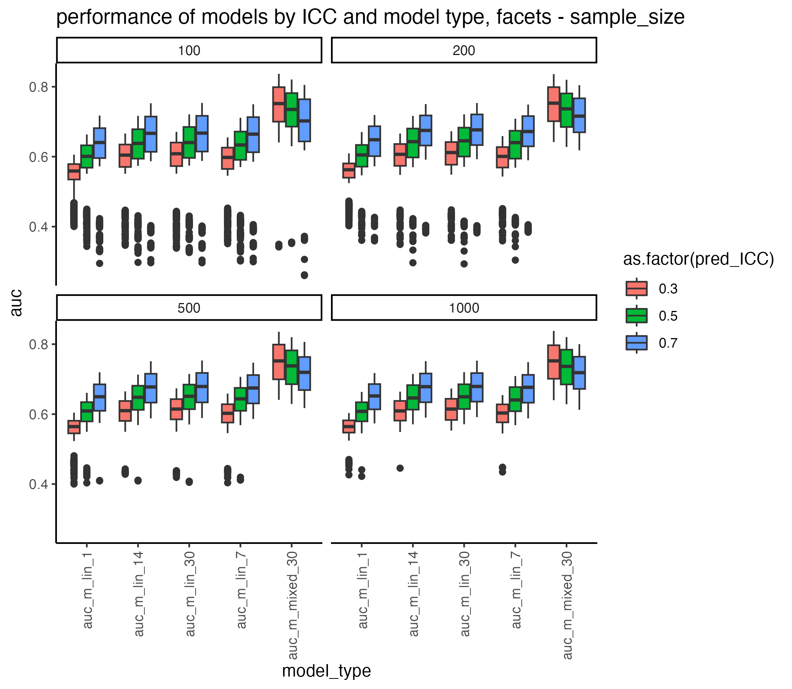

# Repeated measurements can boost ability to predict suicide attempts: a stimulation

Suicide is one of the leading causes of death, especially in younger age groups. Twelve-month prevalence of suicide attempts is 0.3-0.4% (1). Thus, from a statistical point of view, suicide attempts prediction poses all the challenges of predicting a rare phenomenon. At the same time, suicidal behaviors have multiple risk factors that individually have small statistical effects (2). Simulation in this repository shows that one-time or sparse measurements of suicide attempt predictors may severely limit power to detect those small effects. 

If a variable is measured more than once for one patient, intraclass correlation (ICC) can be calculated. High values of ICC mean that variable levels observed in multiple measurements coming from one patient (one class) are congruent, while low values mean that variable levels may vary considerably between measurements. 
ś
ICCs of predictor variables used in suicide research are largely unknown because study designs that allow calculating them gained momentum only recently. In longitudinal research that spans months or years, predictor level at time point 1 is used to model suicide attempt risk at time point 2, and those time points are often a few months apart (or more). This simulation shows that if the predictor's ICC is low, it significantly limits the model's predictive performance because the predictor level at time point 1 can differ considerably from its level at time point 2. 

## How to run the simulation

The simulation can be runed from the file run.R. It should load all neccessary libraries and helper functions from 'functions' folder.

Folder 'sim_data_i[0-9]+_[date]' contains simulation data. Number after "i" informs how many times each model was fitted.

Folder 'figures' contains... figures :)

Code used to produce figures can be found in `analyze_data.R`.

## Models fitted in the simulation

- `m_mixed_30` generalized mixed, fitted on 30 time points, 30 predictions per patient (1 prediction per timepoint), patient id as a random effect
- `m_lin_30` generalized linear, **30** averaged measurements used as a predictor of suicide attempt at any of 30 time points 
- `m_lin_14` generalized linear, **14** averaged measurements used as a predictor of suicide attempt at any of 30 time points 
- `m_lin_7` generalized linear, **7** averaged measurements used as a predictor of suicide attempt at any of 30 time points 
- `m_lin_1` generalized linear, **1** measurement used as a predictor of suicide attempt at any of 30 time points 

## References

1. Borges, G., Nock, M. K., Haro Abad, J. M., Hwang, I., Sampson, N. A., Alonso, J., Andrade, L. H., Angermeyer, M. C., Beautrais, A., Bromet, E., Bruffaerts, R., de Girolamo, G., Florescu, S., Gureje, O., Hu, C., Karam, E. G., Kovess-Masfety, V., Lee, S., Levinson, D., … Kessler, R. C. (2010). Twelve Month Prevalence of and Risk Factors for Suicide Attempts in the WHO World Mental Health Surveys. The Journal of Clinical Psychiatry, 71(12), 1617–1628. https://doi.org/10.4088/JCP.08m04967blu
2. Franklin, J. C., Ribeiro, J. D., Fox, K. R., Bentley, K. H., Kleiman, E. M., Huang, X., Musacchio, K. M., Jaroszewski, A. C., Chang, B. P., & Nock, M. K. (2017). Risk factors for suicidal thoughts and behaviors: A meta-analysis of 50 years of research. Psychological Bulletin, 143(2), 187–232. https://doi.org/10.1037/bul0000084
